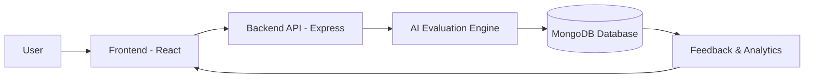

<h1 align="center">Intervyo – AI-Powered Interview Simulation Platform</h1>

Intervyo is an AI-driven interview preparation and evaluation platform designed to simulate real-world technical and HR interviews.  
It helps candidates practice interviews, receive structured, criteria-based feedback, and improve performance through AI analysis instead of vague human opinions.

This is not a generic “chat with AI” project.  
Intervyo is built for realism, accountability, and measurable improvement.

## 📚 Table of Contents

- [Why Intervyo Exists](#why-intervyo-exists)
- [Core Features](#core-features)
	- [AI Interview Simulation](#ai-interview-simulation)
	- [Smart Evaluation & Feedback](#smart-evaluation--feedback)
	- [Interview History & Progress Tracking](#interview-history--progress-tracking)
- [Advanced Multi-Company Features (NEW)](#advanced-multi-company-features-new)
	- [Smart Company Recommendation Engine](#smart-company-recommendation-engine)
	- [Company Interview Calendar Integration](#company-interview-calendar-integration)
	- [Real Interview Question Database](#real-interview-question-database)
- [Tech Stack](#tech-stack)
- [System Architecture](#system-architecture-high-level)
- [Installation & Setup](#installation--setup)
	- [Prerequisites](#prerequisites)
	- [Clone the Repository](#clone-the-repository)
	- [Backend Setup](#backend-setup)
	- [Frontend Setup](#frontend-setup)
	- [Environment Variables](#environment-variables)
- [Docker (Optional)](#docker-optional)
- [Current Status](#current-status)
- [Use Cases](#use-cases)
- [Design Philosophy](#design-philosophy)
- [Contributing](#contributing)
- [Code of Conduct](#code-of-conduct)

---

## 🎯 Why Intervyo Exists

Most interview preparation platforms fail because they:

- Ask generic questions  
- Give fluffy, non-actionable feedback  
- Do not simulate real interview pressure  

Intervyo fixes this by:

- Running structured interviews  
- Evaluating responses against defined criteria  
- Giving actionable feedback, not motivational nonsense  

If it doesn’t help you perform better in a real interview, it doesn’t belong here.

---

## 🧠 Core Features

### 🎤 AI Interview Simulation
- Technical, behavioral, and mixed interview modes  
- Timed questions to simulate real interview pressure  
- Adaptive follow-up questions based on candidate responses  
- **New:** Real-time Body Language Coach (Eye contact & Posture tracking) 👁️

### 📊 Smart Evaluation & Feedback
- Communication clarity analysis  
- Technical correctness scoring  
- Confidence & structure assessment  
- Strengths, weaknesses, and improvement suggestions  
- Live Confidence HUD during interviews 💯

### 📁 Interview History & Progress Tracking
- Store past interviews  
- Compare performance over time  
- Identify recurring weaknesses  

### 🔐 Secure User System
- Authentication & authorization  
- Private interview data  
- Secure API handling  

---

## 🚀 Advanced Multi-Company Features (NEW)

### 🤖 Smart Company Recommendation Engine
- AI-powered analysis of your interview performance
- Personalized company recommendations based on skill level
- Success probability calculation for each company
- Gap analysis with improvement suggestions
- **Route:** `/advanced-features` or `/api/recommendations`

### 📅 Company Interview Calendar Integration
- Track upcoming interview dates with countdown timers
- Automatically generated preparation milestones
- Daily practice recommendations based on days remaining
- Progress tracking and readiness score
- **Route:** `/api/calendar`

### 💎 Real Interview Question Database
- Crowdsourced real interview questions from actual interviews
- Voting system (upvote/downvote) for question quality
- Question verification workflow
- Frequency tracking (how often questions are asked)
- Search and filter by company, difficulty, type
- Trending questions feature
- **Route:** `/api/questions`

### 🤝 Interview Buddy Matching
- Find compatible study partners preparing for same companies
- Compatibility algorithm based on target companies and skill level
- 1-on-1 buddy connections with mock interview scheduling
- Study group creation and management
- **Route:** `/api/buddy`

### 📊 Company-Specific Success Metrics
- Enhanced company profiles with hiring bar benchmarks
- Success thresholds for each interview type
- Difficulty ratings and acceptance rates
- Historical performance statistics

### 🎤 Speech Practice Lab (Frontend)
- Real-time speech-to-text using Web Speech API
- Live metrics: words, WPM, average sentence length, filler words
- Coaching tips for pace and clarity
- Save sessions locally for quick review (no backend required)
- **Route:** `/practice-lab`
- Requires microphone permission in the browser (Chrome recommended)

### 🎬 Interview Replay System (NEW)
- **Full Playback**: Review completed interviews with complete conversation history
- **Timestamped Notes**: Add personal notes at any point with categorization (improvement, strength, mistake, learning)
- **Smart Bookmarks**: Quick-jump to important moments in the interview
- **Resume Functionality**: Pick up where you left off during review sessions
- **Global Search**: Search across all notes and bookmarks from all interviews
- **View Analytics**: Track how often you review each interview and total watch time
- **Secure Sharing**: Generate share links to get feedback from mentors or study buddies
- **Self-Reflection**: Identify patterns and track improvement over time
- **Route:** `/api/replay`
- Perfect for: Post-interview analysis, mentor feedback, peer review, progress tracking

### 🎯 AI-Powered Weakness Predictor & Attack Plan (NEW - OUT OF BOX!)
- **Predictive Intelligence**: Analyzes your last 20 interviews to predict where you'll fail BEFORE your next interview
- **Personalized Attack Plans**: 3-phase improvement strategy (Emergency Fixes → Strengthen Core → Polish & Perfect)
- **Micro-Challenges**: 15 bite-sized, actionable tasks targeting your specific weaknesses (30-90 min each)
- **Success Probability**: Get real probability scores for easy/medium/hard interviews and specific companies
- **Real-Time Progress Tracking**: Improvement score, completion percentage, trend analysis (improving/declining/stable)
- **AI Insights**: Hidden strengths, blind spots, quick wins, peer comparison, long-term goals
- **Weakness Categories**: Tracks 10 areas (technical-depth, system-design, coding-efficiency, communication-clarity, etc.)
- **Severity Levels**: Critical (urgent), High (significant), Medium (polish needed), Low (strengths)
- **Route:** `/api/attack-plan`
- Unique value: **Proactive vs Reactive** - Know your failure points before they happen, not after

---

## 🛠 Tech Stack

### 🎨 Frontend
- React  
- Tailwind CSS  
- Responsive UI (desktop + mobile)

### ⚙️ Backend
- Node.js  
- Express.js  
- MongoDB  
- REST APIs  

### 🤖 AI Layer
- LLM-based interview logic  
- Prompt-engineered evaluation criteria  
- Structured scoring system (not random text output)

---

## 🧩 System Architecture (High Level)


Simple, scalable, and not over-engineered.

---

## ⚙️ Installation & Setup

### 📦 Prerequisites
- Node.js (v18+ recommended)
- MongoDB
- Git

---

### 📥 Clone the Repository
```bash
git clone https://github.com/santanu-atta03/Intervyo  
cd intervyo
```
---

### 🔧 Backend Setup
```bash
cd backend  
npm install  
npm run dev  
```
---
### ⚠️ React Version Compatibility Note

This project currently uses **React 19**.

Some dependencies do not yet officially support React 19.  
As a result, running `npm install` may fail with an `ERESOLVE` peer dependency error.

#### Temporary Workaround

Until full React 19 support is available across dependencies, install frontend packages using:

```bash
npm install --legacy-peer-deps
```
---
### 💻 Frontend Setup
```bash
cd frontend  
npm install  
npm run dev
```
---

### 🔑 Environment Variables

Create a `.env` file in the backend directory:
```bash
PORT=5000  
MONGO_URI=your_mongodb_connection_string  
AI_API_KEY=your_ai_api_key  
```
---

## Docker (Optional)

This setup is for local development only and does not change the default workflows.

1) Create any needed backend env values (optional). The Docker Compose config uses
`Backend/.env.example` by default and overrides the MongoDB host.

2) Start the stack:
```bash
docker compose up --build
```

Frontend: `http://localhost:5173`
Backend: `http://localhost:5000`

If you want to point the frontend to a different API URL, set
`VITE_API_BASE_URL` before building.

---

For a deeper walkthrough and rationale, see `docker_guide.md`.


## 🚦 Current Status

- Core interview flow implemented  
- AI-based evaluation logic working  
- User authentication  
- Advanced analytics (in progress)  
- Multi-role interview templates (planned)

---

## 🎯 Use Cases

- Students preparing for placements  
- Developers preparing for technical interviews  
- Self-assessment before real interviews  
- Mock interview practice without human bias  

---

## 🧠 Design Philosophy

- Realism over gimmicks  
- Feedback over praise  
- Skill improvement over vanity metrics  

This platform is built to expose weaknesses, not hide them.

---

## 🤝 Contributing

Please read [CONTRIBUTING](CONTRIBUTING.md) before opening a pull request.  
Low-effort, spam, or cosmetic-only contributions will be closed.

---

## 📜 Code of Conduct

This project follows the Contributor Covenant Code of Conduct.  
Please read [CODE_OF_CONDUCT](CODE_OF_CONDUCT.md) before contributing.
